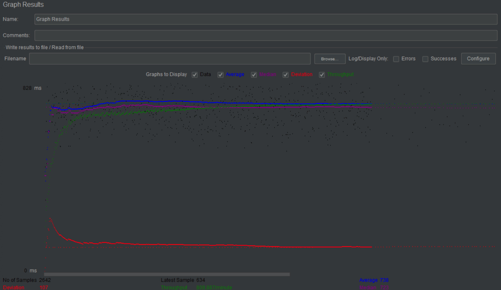

# cs122b-spring20-team-134
cs122b-spring20-team-134 created by GitHub Classroom

# Project 5

- # General
    - #### Team#: 134
    
    - #### Names: Yuting Lu, Wencong She
    
    - #### Project 5 Video Demo Link: https://www.youtube.com/channel/UCQcFNPfJ8Eu5XaMpof1dF1Q?view_as=subscriber

    - #### Instruction of deployment:
    
    	step 1. connect to AWS using .pem key file
    
    	step 2. git clone my project from github and use maven to make a package
    
    	step 3. put the package into tomcat webapp file.
    
    	step 4. go to tomcat mangement webpage and lauch the project(tomcat should be started)

    - #### Collaborations and Work Distribution:
	Yuting Lu: implement the connection pooling and preparestatement.

- # Connection Pooling
    - #### Include the filename/path of all code/configuration files in GitHub of using JDBC Connection Pooling.
    	All the servlet except for shopping cart servlet use connection pooling. Shopping cart servlet retrieve information from session.
	
		For admin management: [Add Movie](web/src/AddMovieServlet.java), [Add Star](web/src/AddStarServlet.java), [Admin Login](web/src/AdminLoginServlet.java), [admin information](web/src/ShowTablesServlet.java)
	
		For customers: [Login](web/src/LoginServlet.java), [main page](web/src/MainServlet.java), [movie list](web/src/MovielistServlet.java), [Autocomplete suggestions](web/src/hiddenServlet/SuggestionServlet.java), [single movie](web/src/SingleMovieServlet.java), [single star](web/src/SingleStarServlet.java), [Payment](web/src/PaymentServlet.java)
    
    - #### Explain how Connection Pooling is utilized in the Fabflix code.
    	In the runtime, The application get a connection pool from each jdbc database resource specified in the context.xml. After that, 	every time the application want to connect to the database, it get a connection from the pool. When the application close the 		connection, the connection is returned to the connection pool.  
    
    - #### Explain how Connection Pooling works with two backend SQL.
    	With two backend SQL, each resource is a connection pool. We have two source of SQL, one is master for read/write, one is slave for read-only. Connection Pooling work the same for both resources.
    

- # Master/Slave
    - #### Include the filename/path of all code/configuration files in GitHub of routing queries to Master/Slave SQL.
     Here is the path to the SQL source files [context](web/WebContent/META-INF/context.xml). The routing source name is hard code in every serlvet. please check above for the link to the source code of every servlet. 

    - #### How read/write requests were routed to Master/Slave SQL?
    We hard code the servlets related to write to the master SQL, and the servlets related to read to local host SQL.

- # JMeter TS/TJ Time Logs
    - #### Instructions of how to use the `log_processing.*` script to process the JMeter logs.

- # JMeter TS/TJ Time Measurement Report

| **Single-instance Version Test Plan**          | **Graph Results Screenshot** | **Average Query Time(ms)** | **Average Search Servlet Time(ms)** | **Average JDBC Time(ms)** | **Analysis** |
|------------------------------------------------|------------------------------|----------------------------|-------------------------------------|---------------------------|--------------|
| Case 1: HTTP/1 thread                          |   | 239ms | 97.2320 ms | 93.7699 ms | This model has the second least average query time, average search Servelt time and Average JDBC time because  There are only one user accessing the database. It also has constant throughtput. The avery spend time are lower than 10 threads|
| Case 2: HTTP/10 threads                        |   | 746ms  | 581.3848 ms| 560.7280 ms | This model is similar with the model in case 3, Its Average search servlet/jdbc time is less than average query time because of the JMeter has network latency, when there are nore users, the average query will increse by a large amount|
| Case 3: HTTPS/10 threads                       |   | 738ms   | 651.6384 ms | 627.5319 ms | ??           |
| Case 4: HTTP/10 threads/No connection pooling  |  | 776ms  | 611.4900 ms | 556.1083 ms | ??           |

| **Scaled Version Test Plan**                   | **Graph Results Screenshot** | **Average Query Time(ms)** | **Average Search Servlet Time(ms)** | **Average JDBC Time(ms)** | **Analysis** |
|------------------------------------------------|------------------------------|----------------------------|-------------------------------------|---------------------------|--------------|
| Case 1: HTTP/1 thread                          |     | 158ms      |  73.4253 ms |  70.9823 ms |??            |
| Case 2: HTTP/10 threads                        |     | 380ms |   270.6216 ms | 260.4966 ms|??            |
| Case 3: HTTP/10 threads/No connection pooling  |     | 339ms  | 319.6313 ms | 303.0927 ms |  ??            | 

1) Demo Video URL:
https://www.youtube.com/channel/UCV_JvWf_CVTPvWHDPn5RM5A?view_as=subscriber

    
2) step1. connect to AWS using .pem key file
    step 2. git clone my project from github and use maven to make a package
    step 3. put the package into tomcat webapp file.
    step 4. go to tomcat mangement webpage and lauch the project(tomcat should be started)
    
3) for prepare statement 
    Please also check [user login](src/LoginServlet.java)
    Please also check [user search](src/MovielistServlet.java)

## Project 4
# Design decision for fuzzy search

Suppose the user input is 'this is a query'

We union the result of substring match '%this is a query%' 

and the similarito match ed(titile, 'this is a query') <=2  

And then we combine with fulltext search. 

# Project 3

### xml parsing instruction:
	
1. put the stanford-movies.tar to "log/"
	
2. unzip using "tar -zxvf stanford-movies.tar"

3. go to root directory where pom.xml located and "mvn clean package"
	
4. run `mvn exec:java -Dexec.mainClass="parser.ParserHandler"`
	
5. go to log/insert_file
	
6. `mysql -u root -p`
	
7. `use moviedb;`
	
8. `source load-data.sql.txt;`

Finish Parsing 

### Parsing Optimization strategies:

0. naive approach:
    
    We use SAX for xml parsing and run a insert query instantly to insert the data after parsing.
    
    Running time: 451s

1. HashMap:
    
    We use hashmap to keep existing movies and stars information instead of running search query multiple times
    
    Running time: 138s on average

2. Data Load:
    
    We use data load method in sql. First we generate txt file in disks and we load the txt file to sql using data load
    
    Running Time: 1s for parsing xml, 1s for data load in sql

Please also check [performance log](log/performanceLog/performance_log.txt)

### Inconsistency:
   
   please check the directory under `log/inconsistency/` which contain all the inconsistency log
    
